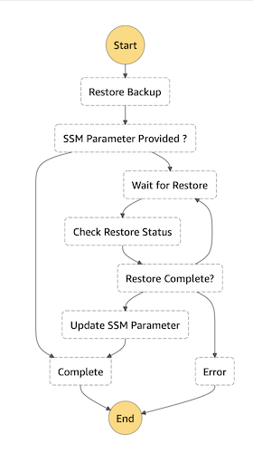
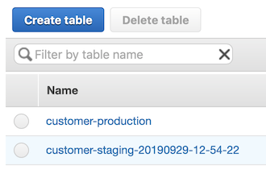

# AWS Backup DynamoDB Rotator

- [AWS Backup DynamoDB Rotator](#aws-backup-dynamodb-rotator)
- [Pre-Requisites](#pre-requisites)
- [Parameters](#parameters)
- [Instructions](#instructions)
- [How it Works](#how-it-works)
  - [AWS Step Functions State Machine](#aws-step-functions-state-machine)

The AWS Backup DynamoDB Rotator ("the app") restores an [Amazon DynamoDB][dynamodb-home] backup to a new timestamped table, allowing you to test your backups and populate reporting, staging, or development environments.

The app subscribes to an [Amazon Simple Notification Service (SNS)][sns-home] topic and listens for messages from AWS Backup. When a `BACKUP_JOB_COMPLETE` event is received, an [AWS Step Functions][step-functions-home] state machine execution begins that restores the backup to a new table. Optionally, once the restore is complete, an [AWS Systems Manager (SSM)][ssm-home] parameter is updated with the ARN of the newly-restored table.

Important: this application uses various AWS services and there are costs associated with these services after the Free Tier usage - please see the [AWS  pricing page](https://aws.amazon.com/pricing/) for details.

```bash
.
├── README.MD                       <-- This README file
├── screenshots                     <-- Screenshots
└── src                             <-- source directory for the AWS Lambda functions
│   └── check-restore-status        <-- dir for the CheckRestoreStatus Lambda Function
│   │   └── main.go                 <-- Lambda function, checks the status of the restored DynamoDB table
│   └── restore-backup              <-- dir for the RestoreBackup Lambda Function
│   │   └── main.go                 <-- Lambda function, initiates the restore of the backed up DynamoDB table
│   └── start-workflow              <-- dir for the StartWorkflow Lambda Function
│   │   └── main.go                 <-- Lambda function, initiates the Step Functions state machine if required
│   └── update-ssm-parameter        <-- dir for the UpdateSSMParameter Lambda Function
│   │   └── main.go                 <-- Lambda function, updates the SSM Parameter if provided
├── Makefile                        <-- Makefile with commands for building the Lambda functions
├── template.yaml                   <-- SAM template
├── CODE_OF_CONDUCT.md              <-- Code of Conduct for contributors to this repository
├── CONTRIBUTING.md                 <-- Guidelines for submitting changes to this repository
├── LICENSE                         <-- Apache-2.0 license file
```

## Pre-Requisites

The app requires the following AWS resources to exist before installation:

1. An AWS Backup vault [configured to send notification events to SNS][backup-sns-guide].

   If you are using the *Default* vault:

   ```bash
   aws backup put-backup-vault-notifications \
     --backup-vault-name Default \
     --sns-topic-arn "arn:aws:sns:{AWS_REGION}:{AWS_ACCOUNT}:{SNS_TOPIC}" \
     --backup-vault-events BACKUP_JOB_COMPLETED
   ```

1. An SNS topic [configured to allow notifications from the Backup vault][sns-backup-config]. Include the following JSON in the access policy of the Amazon SNS topic that you use to track AWS Backup events. You must specify the ARN of your topic.

   ```json
   {
       "Sid": "My-statement-id",
       "Effect": "Allow",
       "Principal": {
           "Service": "backup.amazonaws.com"
       },
       "Action": "SNS:Publish",
       "Resource": "arn:aws:sns:{AWS_REGION}:{AWS_ACCOUNT}:{SNS_TOPIC}"
   }
   ```

1. One or more DynamoDB tables configured in Backup that you wish to restore on a recurring basis.

1. An AWS Backup job in the Backup vault that backs up the DynamoDB tables you wish to restore.

## Parameters

1. `BackupSNSTopicARN` - [Required] The ARN for a previously existing SNS topic to which AWS Backup publishes its notifications. The Step Function will subscribe to this topic and begin execution when a `BACKUP_JOB_COMPLETED` notification is published.

1. `SourcePattern` - [Required] A regular expression matching the table name - not full ARN - of resources to be restored, e.g., `(?i)-production$` for all DynamoDB tables ending with `-production` (case insensitive). To match and restore all DynamoDB tables, use the expression `.*`

1. `ReplacementPattern` - [Required] A replacement expression used to name the restored resource given in the format, e.g., `-staging` to replace the given SourcePatternParameter with `-staging` in the newly restored instance. A date time stamp of the format `-20060102-15-04-05 (-YYYYMMDD-HH-mm-ss)` will be appended to the replacement name in all cases. To use the original name of the restored resource with the date time stamp appended, use `$0` as the replacement expression.

1. `SSMParameterName` - [Optional] The name and path of an AWS Systems Manager (SSM) Parameter Store parameter to be created or updated with the ARN of the newly restored database, e.g., `/staging/database-arn`. This is useful for automating reporting, staging, and test database rollover. This parameter is optional, and if no value is provided no parameter will be created or updated.

## Instructions

***IMPORTANT NOTE:** Creating this application in your AWS account will create and consume AWS resources, which **will cost money**.  Be sure to shut down/remove all resources once you are finished to avoid ongoing charges to your AWS account (see instructions on cleaning up/tear down below).*

### Getting started

To get the AWS Backup DynamoDB Rotator up and running in your own AWS account, follow these steps (if you do not have an AWS account, please see [How do I create and activate a new Amazon Web Services account?](https://aws.amazon.com/premiumsupport/knowledge-center/create-and-activate-aws-account/)):

1. Go to the [AWS Backup DynamoDB Rotator][aws-backup-dynamodb-rotator] page in the AWS Console. *Note: If you are logged in as an IAM user, ensure your account has permissions to create and manage the necessary resources and components for this application.* 
1. Under the *Application Settings* section, enter values for each of the [parameters](#parameters) as described above.
1. Ensure that the checkbox next to *I acknowledge that this app creates custom IAM roles and resource policies.* is selected.
1. In the bottom right, choose *Deploy*. SAR deploys the app into your AWS account.

### Cleaning up

To tear down your application and remove all resources associated with the AWS Backup DynamoDB Rotator, follow these steps:

1. Log into the [Amazon CloudFormation Console][cloudformation-console] and find the stack you created for the demo app.
1. Delete the stack.

*Remember to shut down/remove all related resources once you are finished to avoid ongoing charges to your AWS account.*

## How it Works



The app subscribes to an existing SNS topic where AWS Backup publishes its event notifications. When a BACKUP_JOB_COMPLETE event is received for a DynamoDB table matching a pattern you specify, an AWS Step Functions state machine execution begins that restores the backup to a new table.

The first Lambda function processes the body of an SNS message sent by AWS Backup to an SNS topic. This lambda function determines whether the resource should be restored using a set of business rules, and if so, initiates an AWS Step Functions state machine using the SDK API call [`SFN.StartExecution`][SFN.StartExecution].

### AWS Step Functions State Machine

The first state machine passes input to the state machine in the following format:

```json
{
    "BackupSnsMessage": {
        "StatusMessage": { "type": "string" },
        "RecoveryPointArn": { "type": "string" },
        "BackedUpResourceArn": { "type": "string" },
        "BackupJobID": { "type": "string" }
    },
    "SourcePattern": { "type": "string" },
    "ReplacementPattern": { "type": "string" },
    "SSMParameterName": { "type": "string" }
}
```

When invoked, the state machine invokes a second Lambda function which initiates the restore using the SDK API call [`DynamoDB.RestoreTableFromBackup`][DynamoDB.RestoreTableFromBackup].

Once the restore is initiated, the state machine checks whether an SSM parameter was defined in the CloudFormation/SAM template. If not, execution completes successfully.

If an SSM parameter was defined, the state machine then sleeps for a pre-determined period before invoking a third Lambda function which checks the status of the restore operation using the SDK API call [`DynamoDB.DescribeTable`][DynamoDB.DescribeTable].

If the restore is not yet complete, the state machine enters a loop of sleeping and checking the status of the restore operation.

Once the restore is complete, the state machine invokes a fourth Lambda function which updates the provided SSM parameter with the ARN of the newly-restored DynamoDB table using the SDK API call [`SSM.PutParameter`][SSM.PutParameter].

Each Lambda function adds its return values to the state in the state machine. On completion, the state is in the following format (top level objects only):

```json
{
    "BackupSnsMessage": {},
    "SourcePattern": "",
    "ReplacementPattern": "",
    "SSMParameterName": "",
    "RestoreTableFromBackupOutput": {},
    "DescribeTableOutput": {},
    "UpdateSSMParameterOutput": {}
}
```

Once completed, we have a newly restored copy of our backup named to match the time the backup was started.



Copyright 2019 Amazon.com, Inc. or its affiliates. All Rights Reserved.
SPDX-License-Identifier: Apache-2.0

[aws-backup-dynamodb-rotator]: https://console.aws.amazon.com/lambda/home#/create/app?applicationId=arn:aws:serverlessrepo::637093487455:applications/AWS-Backup-DynamoDB-Rotator
[backup-home]: https://aws.amazon.com/backup/
[backup-sns-guide]: https://docs.aws.amazon.com/en_pv/aws-backup/latest/devguide/sns-notifications.html
[cloudformation-console]: https://console.aws.amazon.com/cloudformation/home
[dynamodb-home]: https://aws.amazon.com/dynamodb/
[serverless-application-repository]: https://console.aws.amazon.com/serverlessrepo/home
[sns-backup-config]: https://docs.aws.amazon.com/en_pv/aws-backup/latest/devguide/sns-notifications.html#specifying-aws-backup-as-a-service-principal
[sns-home]: https://aws.amazon.com/sns/
[ssm-home]: https://aws.amazon.com/systems-manager/
[step-functions-home]: https://aws.amazon.com/step-functions/

[DynamoDB.DescribeTable]: https://docs.aws.amazon.com/sdk-for-go/api/service/dynamodb/#DynamoDB.DescribeTable
[DynamoDB.RestoreTableFromBackup]: https://docs.aws.amazon.com/sdk-for-go/api/service/dynamodb/#DynamoDB.RestoreTableFromBackup
[SFN.StartExecution]: https://docs.aws.amazon.com/sdk-for-go/api/service/sfn/#SFN.StartExecution
[SSM.PutParameter]: https://docs.aws.amazon.com/sdk-for-go/api/service/ssm/#SSM.PutParameter

[restored-table-image]: images/restored-table.png
[state-machine-image]: images/state-machine-image.png
